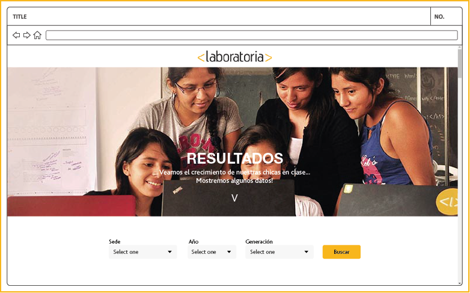
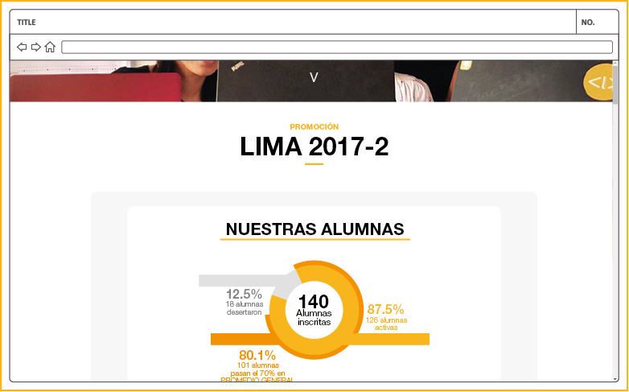
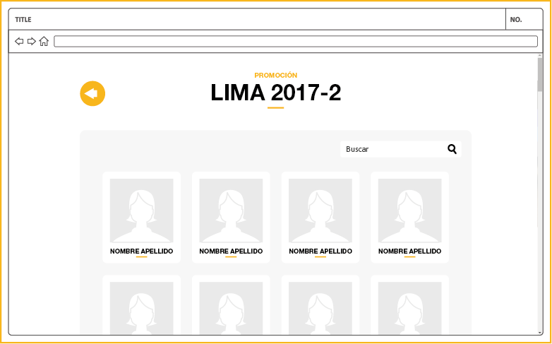
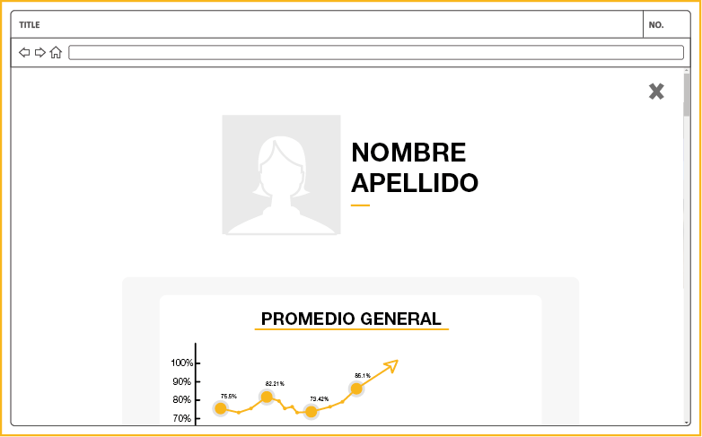
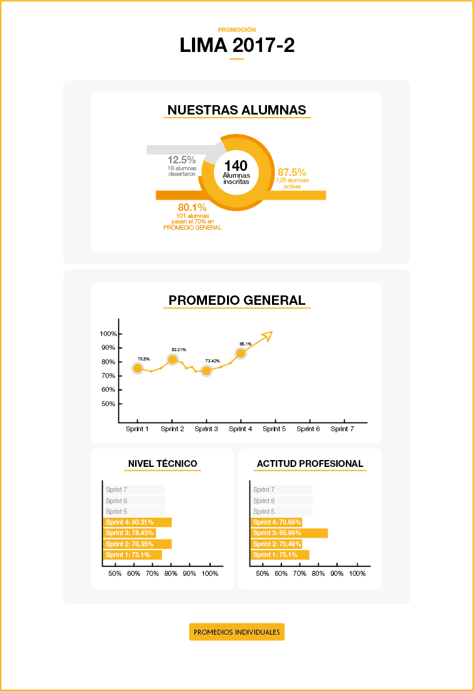
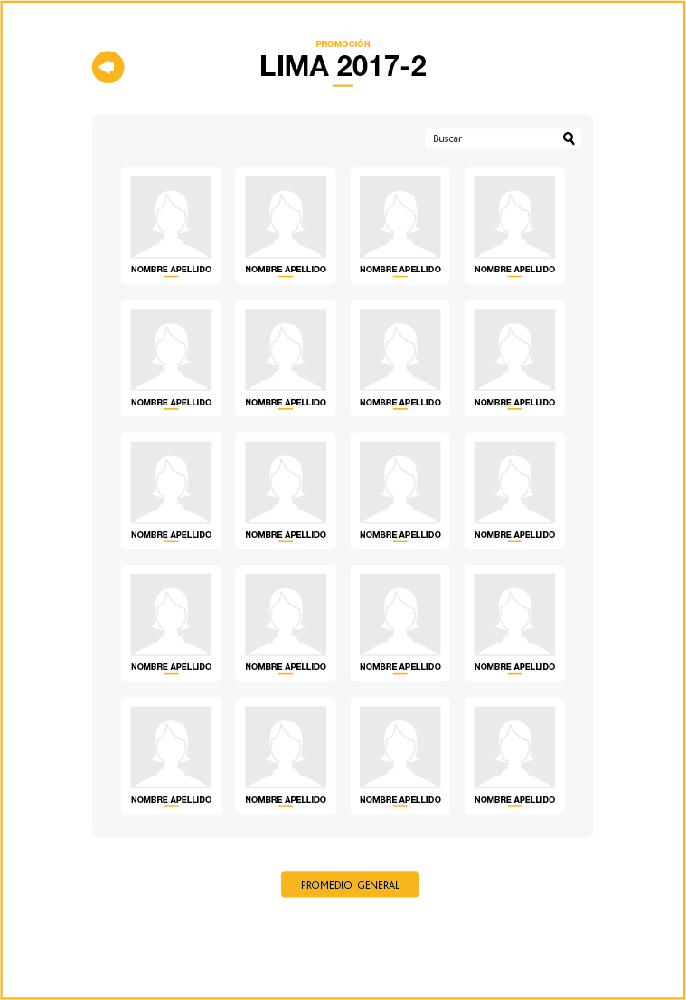
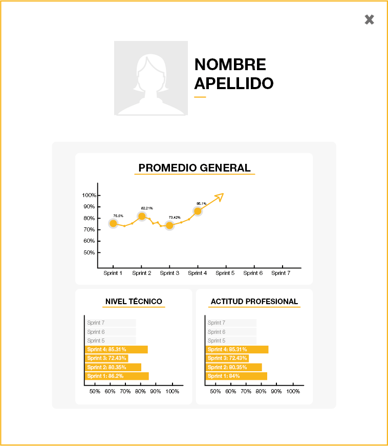

# Sketch para la herramienta del dashboard de Laboratoria

## Sketch
1. Al ingresar a la página principal lo primero que muestra es un filtro el cual te deja elegir SEDE, AÑO Y GENERACIÓN.

2. Como resultado nos muestra el dashboard que se encuentra lineas abajo.

3. El usuario puede solicitar ver promedios individuales con lo cual se mostrara un listado con las alumnas.

4. El listado contiene la información de los promedios de cada alumna,

## Dashboard
Se solicita que este dashboard contenga los siguientes datos:
1. n° de alumnas inscritas
2. n° de alumnas que desertaron
3. n° y % de alumnas que pasan el criterio mínimo de evaluación
4. Promedio de notas por sprint
5. Promedio de notas HSE
6. Promedio de notas técnicas
Por lo cual se implemento la primera sección que encierra en un solo gráfico los 3 primeros datos y una segunda sección que muestra los promedios por separado.

Adicional a ello se crearon opciones para ver los promedios individuales para lo cual se ha creado un listado con las alumnas y la opcion para ingresar a sus gráficos individuales.

